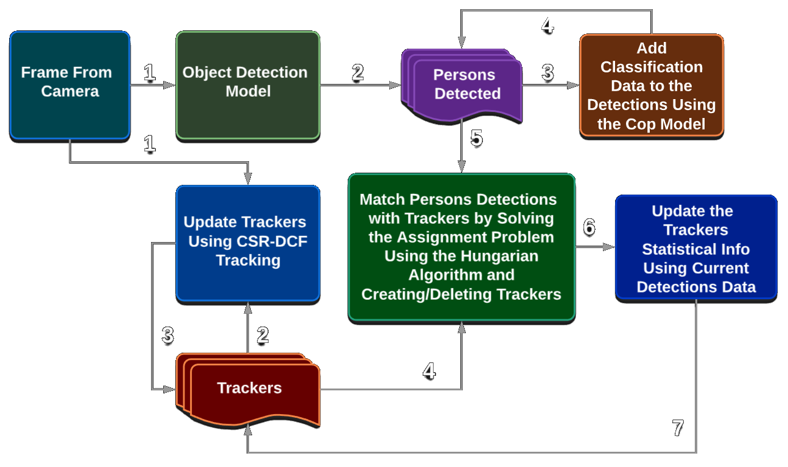
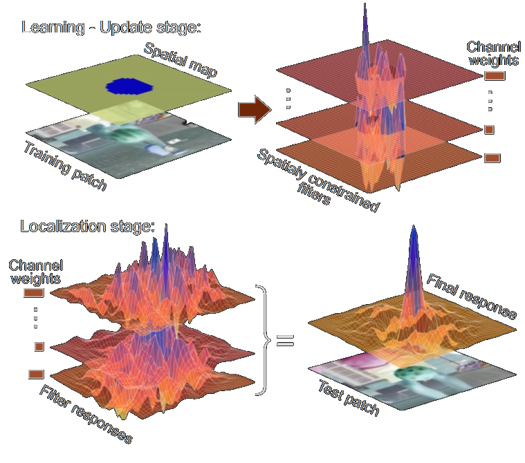
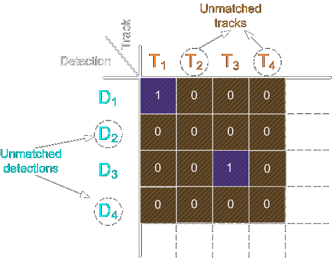

<style>
a    {text-decoration: underline;color: red;}
</style>
# Cops Detection and Tracking - Pipeline Overview

<span style="color:white;">
This project inspired the TrackEverything package and now has an example using it in [this](https://github.com/ami-a/CopDetection) repository.
You can find an old part of this project in one of my repositories [here](https://gitlab.com/Byakugan/police), this repository only contains the small implementation part for webcams and not the whole project.
</span>
## The Pipeline
<span style="color:white;">
The pipeline starts by receiving a series of images (frames) and outputs a list of tracker objects that contains the persons detected and the probability of them being a cop.</span>
<p align="center"></p>

## Breaking it Down to 4 Steps

### 1st Step - Get All Detections in Current Frame 
<span style="color:white;">
First, we take the frame and passe it through an object detection model, I use the base of [this](https://github.com/tensorflow/models/tree/master/research/object_detection) Object Detection repository (I modified the version for TF1 since the TF2 version only came out 10 days ago). This model is trained on the [COCO dataset](http://cocodataset.org/) which detects around 90 different objects, I tried some models with different architectures like the Faster RCNN InceptionV2 and the MobileNetV2. I used the model to give me all the persons detected in a frame. Later I filter out redundant overlapping detections using the Non-maximum Suppression (NMS) method.
</span>
### 2nd Step - Get Classification Probabilities for the Detected Persons
<span style="color:white;">
After we have the persons from step 1, we put them through a classification model to determine the probability of them being a cop. I used the `Xception` CNN architecture with some added layers to train this model, I used this architecture for its low parameters count since my GPU's capacity is limited. </span>
<p align="center"></p>
<span style="color:white;">Then, we create our `Detections` object list and which contains the positions boxes and the classification data. </span>
### 3rd Step - Updated the Trackers Object List
<span style="color:white;">
We have a list of `Trackers` object which is a class that contains an [OpenCV CSRT tracker](https://docs.opencv.org/3.4/d2/da2/classcv_1_1TrackerCSRT.html) (A [Discriminative Correlation Filter Tracker with Channel and Spatial Reliability](https://arxiv.org/abs/1611.08461)).
</span>
<p align="center"><br>Overview of the CSR-DCF approach. An automatically estimated spatial reliability map restricts the correlation filter to the parts suitable for tracking (top) improving localization within a larger search region and performance for irregularly shaped objects. Channel reliability weights calculated in the constrained optimization
step of the correlation filter learning reduce the noise of the weight-averaged filter response (bottom).</p>
<span style="color:white;">
My tracker class also contains a unique ID, previous statistics about this ID and indicators for the accuracy of this tracker. In the first frame, this `Trackers` list is empty and then in step 4, it's being filled with new trackers matching the detected objects. If the `Trackers` list is not empty, in this step we update the trackers positions using the current frame and dispose of failed trackers.
</span>
### 4th Step - Matching Detection with Trackers
<span style="color:white;">
Using intersection over union (IOU) of a tracker bounding box and detection bounding box as a metric. We solve the linear sum assignment problem (also known as minimum weight matching in bipartite graphs) for the IOU matrix using the Hungarian algorithm (also known as Munkres algorithm). The machine learning package `scipy` has a build-in utility function that implements the Hungarian algorithm.
</span>
```bash
matched_idx = linear_sum_assignment(-IOU_mat)
```
<span style="color:white;">
The linear_sum_assignment function by default minimizes the cost, so we need to reverse the sign of IOU matrix for maximization.<br>
The result will look like this:
</span>
<p align="center"></p>
<span style="color:white;">
For each unmatched detector, we create a new tracker with the detector's data, for the unmatched trackers we update the accuracy indicators for the tracker and remove any that are way off. For the matched ones, we update the tracker position to the more accurate detection box, we get the class data and average it with the previous 15 data points of the tracker.
</span>
### 5th Step - Decide What to Do
<span style="color:white;">
After step 4 the `Trackers` list is up to date with all the statistical and current data. The tracker class has a method to return the current classifications and confidence of those scores, we then update the detectors and iterate through them. A detector with low confidence score probably came from a tracker with not enough data or the detection is poor, we mark those in orange. A detector with a high enough confidence score will be green if it's not a cop, and red/blue if it is. The unmatched trackers that are not dead will show in cyan.
</span>


