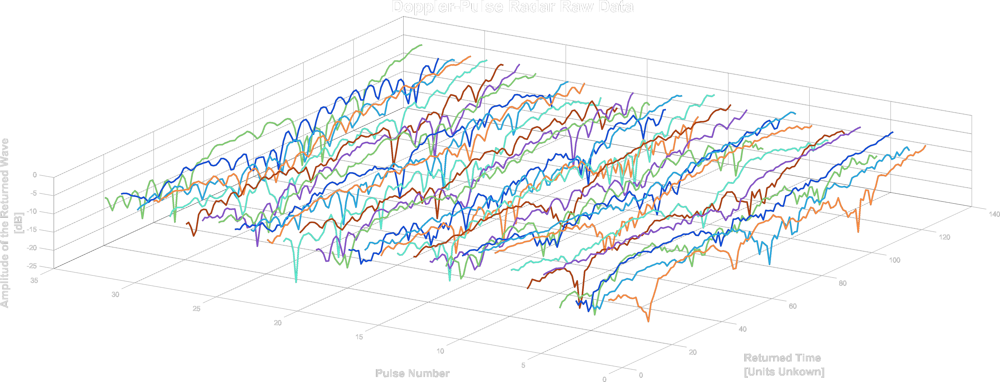

# MAFAT Radar Challenge
## Introduction

This competition by MAFAT’s DDR&D (Directorate of Defense Research & Development) tackles the challenge of classifying living, non-rigid objects detected by doppler-pulse radar systems. The competition was divided into two stages, where the first stage was mainly for training and the second stage for testing. This challenge had over **1K participants**.

### The Radar

The type of radar the data comes form is called a Pulse-Doppler Radar. A Pulse-Doppler Radar is a radar system that determines the range to a target using pulse-timing techniques, and uses the Doppler effect of the returned signal to determine the target object's velocity.
Each radar “stares” at a fixed, wide area of interest. Whenever an animal or a human moves within the radar’s covered area, it is detected and tracked. The dataset contains records of those tracks. The tracks in the dataset are split into 32 time-unit segments. Each record in the dataset represents a single segment.
  
A segment consists of a matrix with I/Q values and metadata. The matrix of each segment has a size of 32x128. The X-axis represents the pulse transmission time, also known as “slow-time”. The Y-axis represents the reception time of signals with respect to pulse transmission time divided into 128 equal sized bins, also known as “fast-time”. The Y-axis is usually referred to as “range” or “velocity” as wave propagation depends on the speed of light.
  
The radar’s raw, original received signal is a wave defined by amplitude, frequency, and phase. Frequency and phase are treated as a single-phase parameter. Amplitude and phase are represented in polar coordinates relative to the transmitted burst/wave. 
Upon reception, the raw data is converted to cartesian coordinates, i.e., I/Q values. The values in the matrix are complex numbers: I represents the real part, and Q represents the imaginary part.

 Example of a raw segment from the data, which was converted to power units. Each pulse was fired in “slow-time” intervals (32 times per segment).

### Data & Dataset Structure

The metadata of a segment includes track id, location id, location type, day index, sensor id and the SNR level. The segments were collected from several different geographic locations, a unique id was given per location. Each location consists of one or more sensors, a sensor belongs to a single location. A unique id was given per sensor. Each sensor has been used in one or more days, each day is represented by an index. A single track appears in a single location, sensor and day. The segments were taken from longer tracks, each track was given a unique id.
  
In Stage 1:

- 5 Pickle files for the Training set, Public Test set (Public), and Auxiliary set (3 files). 
- 5 CSV files for metadata of the Training set, Public Test set, and Auxiliary set (3 files). 
In the Test set metadata CSV file there are two fields 'segment_id' and 'snr_type'.
  
In Stage 2:

- 2 Pickle files for the Private Test set and the full tracks of the Public Test set.
- 2 CSV files for metadata of the Private Test set and the full tracks of the Public Test set. 
In the Private Test set metadata CSV file there are two fields 'segment_id' and 'snr_type'.

### Auxiliary datasets

In addition to the Training set described above, the data set also contains auxiliary data:

- **Synthetic** low SNR segments that were created by transforming the high SNR signals from the train set.
- **“Background”** segments – Segments that were recorded by a sensor in parallel to segments with tracks but at a different range. These segments contain the recorded “noise.” Each segment also contains a field mapping to the original High or Low SNR track id. 
- **“Experiment”** locations – In these locations, only humans were recorded in a controlled environment, which doesn't necessarily reflect a “natural” recording. 

### Submission
## My Strategy
### Data Partition
### Spectrograms
### Micro Doppler Effect
### Model
## Results

