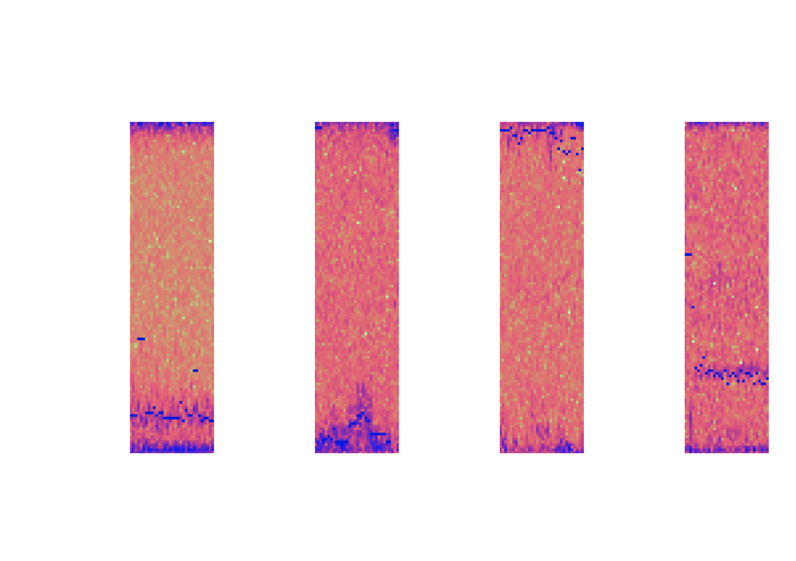

<style>
a    {text-decoration: underline;color: red;}
li    {color: white;}
pre {
  max-height: 200px;
  overflow-y: auto;
}
</style>
# MAFAT Radar Challenge
## Introduction
<span style="color:white;">
This competition by MAFAT’s DDR&D (Directorate of Defense Research & Development) tackles the challenge of classifying living, non-rigid objects detected by doppler-pulse radar systems. The competition was divided into two stages, where the first stage was mainly for training and the second stage for testing. This challenge had over **1K participants**. You can view the competition site [here](https://competitions.codalab.org/competitions/25389).
</span>

### The Radar
<span style="color:white;">
The type of radar the data comes form is called a Pulse-Doppler Radar. A Pulse-Doppler Radar is a radar system that determines the range to a target using pulse-timing techniques, and uses the Doppler effect of the returned signal to determine the target object's velocity.
Each radar “stares” at a fixed, wide area of interest. Whenever an animal or a human moves within the radar’s covered area, it is detected and tracked. The dataset contains records of those tracks. The tracks in the dataset are split into 32 time-unit segments. Each record in the dataset represents a single segment.
<br><br>
A segment consists of a matrix with I/Q values and metadata. The matrix of each segment has a size of 32x128. The X-axis represents the pulse transmission time, also known as “slow-time”. The Y-axis represents the reception time of signals with respect to pulse transmission time divided into 128 equal sized bins, also known as “fast-time”. The Y-axis is usually referred to as “range” or “velocity” as wave propagation depends on the speed of light.
<br><br>
The radar’s raw, original received signal is a wave defined by amplitude, frequency, and phase. Frequency and phase are treated as a single-phase parameter. Amplitude and phase are represented in polar coordinates relative to the transmitted burst/wave. 
Upon reception, the raw data is converted to cartesian coordinates, i.e., I/Q values. The values in the matrix are complex numbers: I represents the real part, and Q represents the imaginary part.
</span>
<p align="center"><br>Example of a raw segment from the data, which was converted to power units. Each pulse was fired in “slow-time” intervals (32 times per segment).</p>

### Data & Dataset Structure
<span style="color:white;">
The metadata of a segment includes track id, location id, location type, day index, sensor id and the SNR level. The segments were collected from several different geographic locations, a unique id was given per location. Each location consists of one or more sensors, a sensor belongs to a single location. A unique id was given per sensor. Each sensor has been used in one or more days, each day is represented by an index. A single track appears in a single location, sensor and day. The segments were taken from longer tracks, each track was given a unique id.
<br><br>
The sets:</span>

* **Training set:** As the name describes, the training set consists of a combination of human and animal, with high and low SNR readings created from authentic doppler-pulse radar recordings.
<br>(**6656 Entries**)

* **Test set:** For the purposes of the competition, a test set is included to evaluate the quality of the model and rank competitors. The set is unlabeled but does include a balanced mix of high and low SNR.
<br>(**106 Entries**)

* **Synthetic Low SNR set:** Using readings from the training set a low SNR dataset has been artificially created by sampling the high SNR examples and artificially populating the samples with noise. This set can be used to better train the model on low SNR examples.
<br>(**50883 Entries**)

* **The Background set:** The background dataset includes readings gathered from the doppler-pulse radars without specific targets. This set could be used to help the model better distinguish noise in the labeled datasets and help the model distinguish relevant information from messy data.
<br>(**31128 Entries**)

* **The Experiment set:** The final set and possibly the most interesting, the experiment set includes humans recorded by the doppler-pulse radar in a controlled environment. Whilst not natural this could be valuable for balancing the animal-heavy training set provided.
<br>(**49071 Entries**)

### Submissions
<span style="color:white;">
In stage 1 we could submit, up to two times a day, the public test set. Submissions are evaluated on the Area Under the Receiver Operating Characteristic Curve (ROC AUC) between the predicted probability and the observed target.
In the second stage we could submit, up to two times total, the private test set.
</span>

## My Strategy
### My Tools
<span style="color:white;">
I only used my laptop for all the competition, it has a Nvidia GPU but with only 2GB of memory. Initially I had 32GB RAM but one of my sticks got fried from over processing so I got stuck with 16GB RAM close to the end (since there was a curfew so I could not have replaced it) .
<br><br>
I mainly used **MATLAB** for testing different signal processing methods that will work well on the data. I used **Python** for implementing the signal processing methods I found and preprocess the data, train and test it using **Keras** models in **TensorFlow**.
</span>

### Data Synthesization & Partition
<span style="color:white;">
It is important to ensure the data is balanced and unbiased as this can lead to significant misinterpretations of the set by the model, and small inconsistencies can get extrapolated into significant errors. Since the datasets are not balanced at all in categories like object(Human/Animal), SNR(High/Low), topography(Woods, Synthetic etc.) and the amount of data from each category is limited it was a challenge to find the right partition for the training and validation data.
<br><br>
For example this is the code for the training dataset partition:
</span>

```python
    geo1=((training_df["geolocation_id"]==1)&(training_df['segment_id'] % 4 == 0))#58
    geo2=((training_df["geolocation_id"]==2)&(training_df['segment_id'] % 3 == 0))#63
    geo3=((training_df["geolocation_id"]==3)&(training_df['segment_id'] % 16 == 0))#65
    geo4=((training_df["geolocation_id"]==4)&(training_df['segment_id'] % 3 == 0))#64
    train_NH_HS=((training_df["target_type"]!="human") & (training_df["snr_type"]=="HighSNR")&np.logical_not(geo1|geo2|geo3|geo4))
    train_NH_HS_val=((training_df["target_type"]!="human") & (training_df["snr_type"]=="HighSNR")&(geo1|geo2|geo3|geo4))#250

    geo1=((training_df["geolocation_id"]==1)&(training_df['segment_id'] % 4 == 0))#59
    geo2=((training_df["geolocation_id"]==2)&(training_df['segment_id'] % 1 == 0))#61
    geo3=((training_df["geolocation_id"]==3)&(training_df['segment_id'] % 57 == 0))#61
    geo4=((training_df["geolocation_id"]==4)&(training_df['segment_id'] % 5 == 0))#57
    train_NH_LS=((training_df["target_type"]!="human") & (training_df["snr_type"]=="LowSNR")&np.logical_not(geo1|geo2|geo3|geo4))#3.8k
    train_NH_LS_val=((training_df["target_type"]!="human") & (training_df["snr_type"]=="LowSNR")&(geo1|geo2|geo3|geo4))#238

    geo1=((training_df["geolocation_id"]==1)&(training_df['segment_id'] % 4 == 0))#111
    geo4=((training_df["geolocation_id"]==4)&(training_df['segment_id'] % 3 == 0))#123
    train_H_HS=((training_df["target_type"]=="human") & (training_df["snr_type"]=="HighSNR")&np.logical_not(geo1|geo4))#577
    train_H_HS_val=((training_df["target_type"]=="human") & (training_df["snr_type"]=="HighSNR")&(geo1|geo4))#234

    geo1=((training_df["geolocation_id"]==1)&(training_df['date_index'] % 3 == 0))#21
    geo4=((training_df["geolocation_id"]==4)&(training_df['segment_id'] % 3 == 0))#19
    train_H_LS=((training_df["target_type"]=="human") & (training_df["snr_type"]=="LowSNR")&np.logical_not(geo1|geo4))#48
    train_H_LS_val=((training_df["target_type"]=="human") & (training_df["snr_type"]=="LowSNR")&(geo1|geo4))#40

    train_idx=[]
    train_val_idx=[]
    if snr=="All" or snr=="Low":
        train_idx+=train_NH_LS+train_H_LS
        train_val_idx+=train_NH_LS_val+train_H_LS_val
    if snr=="All" or snr=="High":
        train_idx+=train_NH_HS+train_H_HS
        train_val_idx+=train_NH_HS_val+train_H_HS_val
```
<span style="color:white;">
Together with the rest of the partitions we get a balanced training and validation sets in terms of targets, SNR and geolocations. 
<br><br>
I had to synthesize a new dataset to create new low SNR segments with animals. I added different noises, similar to the noise in other segments, to high SNR animal segments to create this new dataset.
</span>

### Spectrograms
<span style="color:white;">
By going to the frequency domain using the Fourier Transform we can interpret the radar data qualit easily.</span>
<p align="center"><br>An example of the data included for the competition split by Animal/Human and High/Low Signal-Noise-Ratio. The I/Q matrices have been converted into spectrograms for visualization, and the target's doppler center-of-mass readings have been added as blue dots. </p>
<span style="color:white;">
As you can see it's not easy to identify the target only by the spectrogram (especially when units of measurement are not available), but using CNN we might detect patterns that are not easy to see.
</span>

### Micro Doppler Effect

<span style="color:white;">
Since my rig was limited and training was taking days and I could not even use relatively light model like ResNet, I used my knowledge in Physics to look for an edge. The Doppler effect in this case is the shift in the light frequency due to the relative speed of the target. But targets that has motions relative to itself (or it center of mass), like the rotation of the wheels on a car or the swinging of the hands when walking, creates additional shifts in the light frequency that is called Micro-Doppler Effect.
<br><br>
Studding the MATLAB repository [kozubv/doppler_radar](https://github.com/kozubv/doppler_radar) I could simulate micro-Doppler effects that a human will create. First by creating a simulation of a human body walking:</span>
<p align="center"><br>A simulation of human body walking in MATLAB. The dots are the spots where the light will reflect from in the radar simulation.</p>

### Model
## Results


