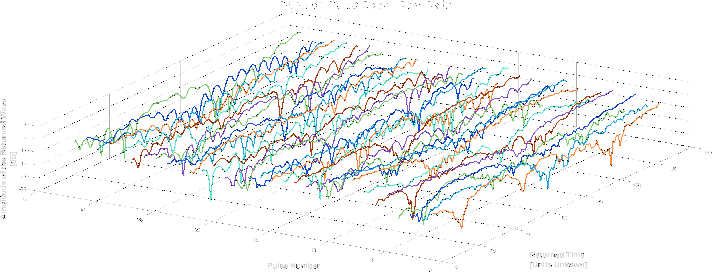
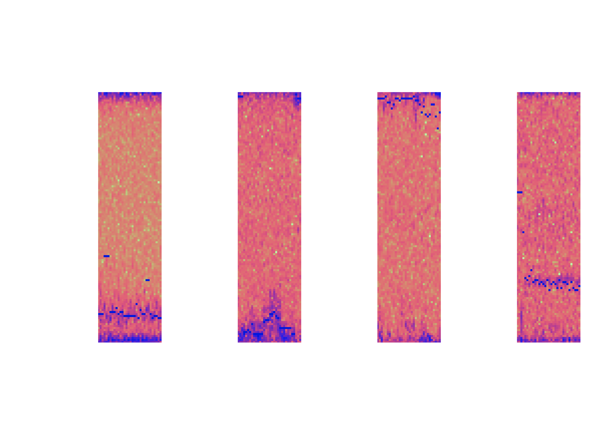
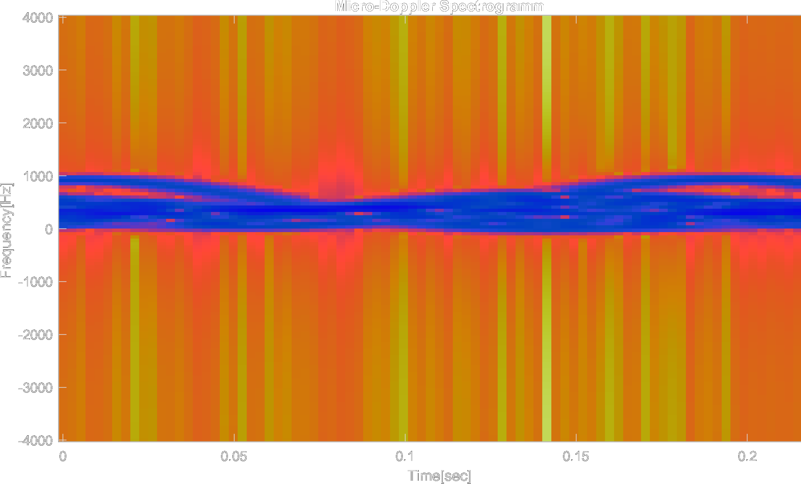
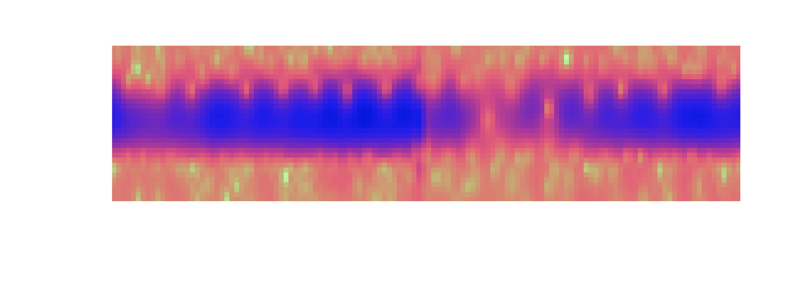
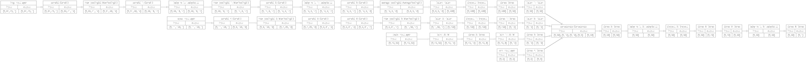

<style>
a    {text-decoration: underline;color: red;}
li    {color: white;}
pre {
  max-height: 200px;
  overflow-y: auto;
}
</style>

# MAFAT Radar Challenge

## Introduction
<span style="color:white;">
This project was my entry in a MAFAT DDR&D (Directorate of Defense Research & Development) competition focused on classifying living, non-rigid objects detected by Doppler-pulse radar systems. The competition was divided into two stages: a first stage focused mainly on public-test evaluation and model development, and a second stage focused on private-test evaluation. The challenge had over **1K participants**. You can view the competition site [here](https://competitions.codalab.org/competitions/25389).
</span>

### The Radar
<span style="color:white;">
The dataset was collected using Pulse-Doppler Radar. A Pulse-Doppler Radar system determines a target’s range using pulse-timing techniques and uses the Doppler effect in the returned signal to estimate the target object’s velocity.
<br><br>
Each radar “stares” at a fixed, wide area of interest. When an animal or human moves inside the covered area, the radar detects and tracks it. The dataset contains records from those tracks. Tracks were split into 32 time-unit segments, and each record in the dataset represents one segment.
<br><br>
Each segment consists of a matrix of I/Q values and metadata. The matrix size is 32x128. The X-axis represents pulse transmission time, also known as “slow-time”. The Y-axis represents signal reception time with respect to pulse transmission time, divided into 128 equal-size bins, also known as “fast-time”. The Y-axis is usually interpreted as “range” or “velocity”, since wave propagation depends on the speed of light.
<br><br>
The radar’s raw received signal is a wave defined by amplitude, frequency, and phase. Frequency and phase are treated as a single phase parameter. Amplitude and phase are represented in polar coordinates relative to the transmitted burst/wave. After reception, the raw data is converted to cartesian coordinates as I/Q values. The matrix values are complex numbers: I represents the real part, and Q represents the imaginary part.
</span>

<p align="center"><br>Example of a raw segment from the data, converted to power units. Each pulse was fired in “slow-time” intervals, 32 times per segment.</p>

### Data & Dataset Structure
<span style="color:white;">
The metadata for each segment includes track id, location id, location type, day index, sensor id, and SNR level. Segments were collected from several geographic locations, with a unique id assigned to each location. Each location contains one or more sensors, and each sensor belongs to a single location. Sensors were used across one or more days, with each day represented by an index. A single track appears in one location, one sensor, and one day. Segments were extracted from longer tracks, and each track received a unique id.
<br><br>
The datasets:</span>

* **Training set:** A labeled combination of human and animal examples, with high-SNR and low-SNR readings created from authentic Doppler-pulse radar recordings.
<br>(**6656 Entries**)

* **Test set:** An unlabeled set used to evaluate model quality and rank competitors. The set included a balanced mix of high-SNR and low-SNR examples.
<br>(**106 Entries**)

* **Synthetic Low SNR set:** A low-SNR dataset artificially created from training-set readings by sampling high-SNR examples and adding noise. This set was useful for improving model robustness on low-SNR examples.
<br>(**50883 Entries**)

* **The Background set:** Radar readings collected without specific targets. This set helped the model distinguish target-relevant signal from messy background noise.
<br>(**31128 Entries**)

* **The Experiment set:** Human recordings captured by Doppler-pulse radar in a controlled environment. Although not naturalistic, this dataset was valuable for balancing the animal-heavy training data.
<br>(**49071 Entries**)

### Submissions
<span style="color:white;">
In stage 1, competitors could submit predictions for the public test set up to two times per day. Submissions were evaluated using Area Under the Receiver Operating Characteristic Curve (ROC AUC) between predicted probabilities and observed targets. In stage 2, competitors could submit predictions for the private test set up to two times total.
</span>

## My Strategy

### Tools & Constraints
<span style="color:white;">
I completed the competition using only my laptop. It had an Nvidia GPU, but only 2GB of GPU memory. I initially had 32GB of RAM, but one RAM stick failed from heavy training near the end of the competition, leaving me with 16GB of RAM during the final period.
<br><br>
I mainly used **MATLAB** to test signal-processing methods and inspect how different transformations behaved on the radar data. I used **Python** to implement the selected preprocessing pipeline, train models, evaluate predictions, and run deep-learning experiments with **Keras** models in **TensorFlow**.
</span>

### Data Synthesis & Partitioning
<span style="color:white;">
Balanced and unbiased data partitioning was one of the most important parts of the project. Small inconsistencies in a dataset can be amplified by a model into significant prediction errors, especially when categories are unevenly represented. The original datasets were imbalanced across several dimensions, including target type (Human/Animal), SNR (High/Low), topography, geolocation, sensor, and data source. Because the amount of data in some categories was limited, finding a reliable split for training and validation required careful control.
<br><br>
For example, this is part of the code used for the training dataset partition:
</span>

```python
    geo1=((training_df["geolocation_id"]==1)&(training_df['segment_id'] % 4 == 0))#58
    geo2=((training_df["geolocation_id"]==2)&(training_df['segment_id'] % 3 == 0))#63
    geo3=((training_df["geolocation_id"]==3)&(training_df['segment_id'] % 16 == 0))#65
    geo4=((training_df["geolocation_id"]==4)&(training_df['segment_id'] % 3 == 0))#64
    train_NH_HS=((training_df["target_type"]!="human") & (training_df["snr_type"]=="HighSNR")&np.logical_not(geo1|geo2|geo3|geo4))
    train_NH_HS_val=((training_df["target_type"]!="human") & (training_df["snr_type"]=="HighSNR")&(geo1|geo2|geo3|geo4))#250

    geo1=((training_df["geolocation_id"]==1)&(training_df['segment_id'] % 4 == 0))#59
    geo2=((training_df["geolocation_id"]==2)&(training_df['segment_id'] % 1 == 0))#61
    geo3=((training_df["geolocation_id"]==3)&(training_df['segment_id'] % 57 == 0))#61
    geo4=((training_df["geolocation_id"]==4)&(training_df['segment_id'] % 5 == 0))#57
    train_NH_LS=((training_df["target_type"]!="human") & (training_df["snr_type"]=="LowSNR")&np.logical_not(geo1|geo2|geo3|geo4))#3.8k
    train_NH_LS_val=((training_df["target_type"]!="human") & (training_df["snr_type"]=="LowSNR")&(geo1|geo2|geo3|geo4))#238

    geo1=((training_df["geolocation_id"]==1)&(training_df['segment_id'] % 4 == 0))#111
    geo4=((training_df["geolocation_id"]==4)&(training_df['segment_id'] % 3 == 0))#123
    train_H_HS=((training_df["target_type"]=="human") & (training_df["snr_type"]=="HighSNR")&np.logical_not(geo1|geo4))#577
    train_H_HS_val=((training_df["target_type"]=="human") & (training_df["snr_type"]=="HighSNR")&(geo1|geo4))#234

    geo1=((training_df["geolocation_id"]==1)&(training_df['date_index'] % 3 == 0))#21
    geo4=((training_df["geolocation_id"]==4)&(training_df['segment_id'] % 3 == 0))#19
    train_H_LS=((training_df["target_type"]=="human") & (training_df["snr_type"]=="LowSNR")&np.logical_not(geo1|geo4))#48
    train_H_LS_val=((training_df["target_type"]=="human") & (training_df["snr_type"]=="LowSNR")&(geo1|geo4))#40

    train_idx=[]
    train_val_idx=[]
    if snr=="All" or snr=="Low":
        train_idx+=train_NH_LS+train_H_LS
        train_val_idx+=train_NH_LS_val+train_H_LS_val
    if snr=="All" or snr=="High":
        train_idx+=train_NH_HS+train_H_HS
        train_val_idx+=train_NH_HS_val+train_H_HS_val
```

<span style="color:white;">
Together with the rest of the partitioning logic, this produced training and validation sets that were more balanced across targets, SNR levels, and geolocations.
<br><br>
I also synthesized a new dataset of low-SNR animal segments by adding noise patterns, similar to those observed in other segments, to high-SNR animal segments. This helped strengthen model exposure to low-quality radar readings.
</span>

### Spectrograms
<span style="color:white;">
Moving the radar data into the frequency domain using the Fourier Transform made it easier to inspect signal quality and expose patterns that were not obvious in the raw I/Q matrices.</span>

<p align="center"><br>An example of the competition data split by Animal/Human and High/Low Signal-Noise-Ratio. The I/Q matrices were converted into spectrograms for visualization, and the target's Doppler center-of-mass readings were added as blue dots.</p>

<span style="color:white;">
The spectrograms show that the target class is not easy to identify visually, especially when measurement units are unavailable. However, CNNs can often detect weak patterns that are difficult to isolate manually.
</span>

### Micro-Doppler Effect
<span style="color:white;">
Because my hardware was limited and model training could take days, I looked for signal-processing advantages that could improve performance without simply increasing model size. A relatively lightweight model such as ResNet50 was already too heavy for my setup, so I used my physics background to focus on micro-Doppler information.
<br><br>
The Doppler effect is the shift in frequency caused by the relative motion of a target. Targets with internal motion relative to their own center of mass, such as rotating wheels or swinging arms during walking, produce additional frequency shifts known as the Micro-Doppler Effect.
<br><br>
By studying the MATLAB repository [kozubv/doppler_radar](https://github.com/kozubv/doppler_radar), I simulated the micro-Doppler effects a walking human could create. The first step was simulating a walking human body:
</span>

<p align="center"><br>A simulation of a human body walking in MATLAB. The dots are the reflection points used in the radar simulation.</p>

<span style="color:white;">
The resulting micro-Doppler spectrogram:</span>

<p align="center"><br>The resulting micro-Doppler spectrogram from the human walking simulation. The leg movement corresponds to the wave patterns in the spectrogram.</p>

<span style="color:white;">
Extracting micro-Doppler spectrograms from the competition segments was difficult because each segment contained only 32 pulses and the data was noisy. By combining signal filters, windows, and different extraction configurations, I was able to produce usable micro-Doppler representations.
</span>

<p align="center"><br>The resulting micro-Doppler spectrogram from a segment.</p>

### The Model
<span style="color:white;">
Model design was constrained by hardware. The training set contained more than 20K segments, and each segment could produce around 3-4 different spectrograms plus metadata. My computer could not run ResNet50 even with a single spectrogram input per segment, so the architecture had to be lightweight, modular, and efficient.
<br><br>
I combined ideas from multiple research articles that used spectrograms and micro-Doppler spectrograms for object identification. The model started as a simple CNN and gradually evolved into a multi-input hybrid architecture. The final direction merged two CNN branches, one RNN branch, and a simple dense neural-network branch. Low-resolution spectrograms were passed into CNN components to reduce training cost, one of the micro-Doppler spectrograms was passed through the RNN branch, and metadata such as SNR was passed into dense layers.
<br><br>
This design used both visual-like frequency-domain features and sequence-oriented radar cues. The RNN path was especially relevant because, historically, experienced radar operators could sometimes identify targets by sound-like signal patterns.
<br><br>
Here is an example of one of the model architectures I constructed:
</span>

<p align="center"><br>An example of one of my model architectures.</p>

## Results
<span style="color:white;">
I reached around 90% accuracy (ROC AUC) on the full public test and around 80% on the private test. I placed 30th out of 1K+ participants, including companies such as Israel Aerospace Industries (IAI) and Rafael, as well as university research groups.
<br><br>
During phase 1, there appeared to be attempts at cheating. My guess was that some competitors submitted random predictions and used the returned scores to reconstruct parts of the correct results. Even with limited hardware and available time, this project was valuable because it strengthened my practical experience in radar signal processing, data synthesis, model design under constraints, and applied AI research.
</span>
