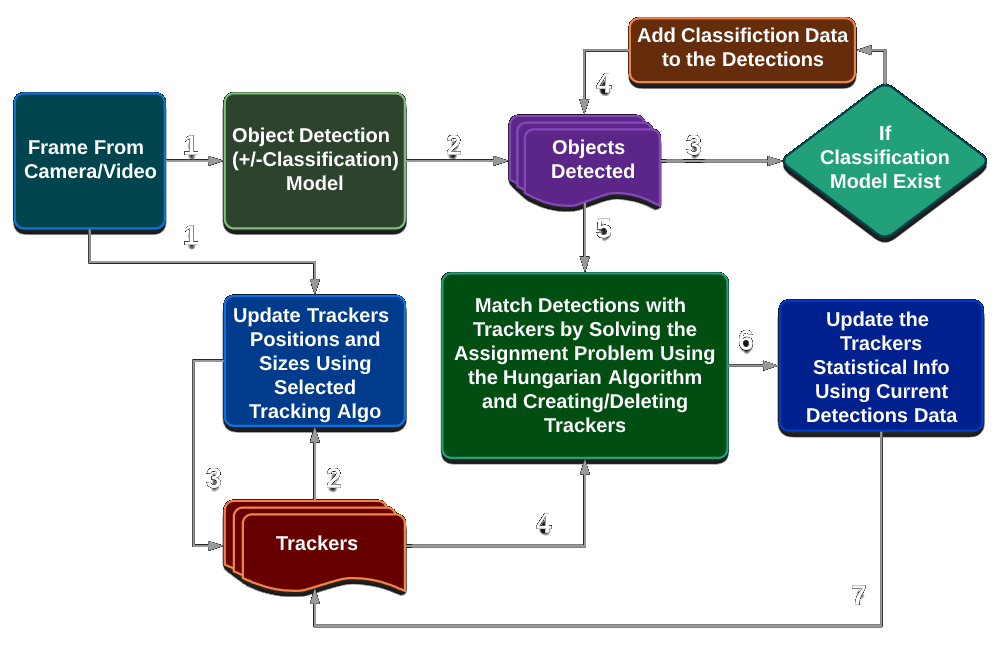
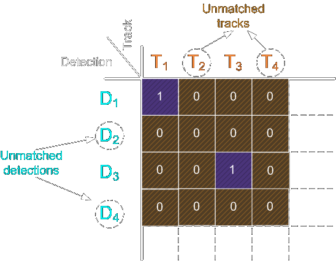

<style>
a { text-decoration: underline; color: red; }
.project-copy { color: white; }
.project-copy p, .project-copy li { color: white; }
</style>

<div class="project-copy">

# TrackEverything — Pipeline Overview

TrackEverything is available on GitHub [here](https://github.com/ami-a/TrackEverything).

## The Core Idea

Most detection and classification models make predictions frame by frame. TrackEverything adds temporal memory on top of those predictions.

Instead of treating every frame as an isolated event, the package connects detections across time, maintains tracker objects for detected entities, accumulates classification statistics, and uses multi-frame evidence to produce more stable tracking and classification results.

## The Pipeline

The pipeline receives a sequence of images or video frames and outputs a list of tracker objects. Each tracker represents an observed object, its current location, its tracking history, and the probability of that object belonging to each class.

<p align="center"></p>

## Breaking the Pipeline Down into 5 Steps

### 1st Step — Get All Detections in the Current Frame

The current frame is passed through an object detection model. The package is designed to work with Python-based detection models, including models from libraries such as TensorFlow or PyTorch.

After detection, redundant overlapping bounding boxes are filtered using Non-Maximum Suppression, or NMS. The remaining detections are added to the `detections` list.

### 2nd Step — Get Classification Probabilities for Detected Objects

After the detections are collected, each detected object is passed through a classification model to estimate its class probabilities.

This is done by cropping the frame around each object’s bounding box and passing the cropped region into the classification model. The resulting probability vector is added to the corresponding item in the `detections` list.

If no separate classification model is supplied, classification can be handled during the detection step instead.

### 3rd Step — Update the Tracker Object List

The package maintains a list of `trackers`. Each tracker object contains an OpenCV tracker, a unique ID, historical statistics for that ID, and indicators describing the reliability of the tracker.

On the first frame, the `trackers` list is empty. New trackers are later created from unmatched detections.

On later frames, existing trackers are updated using the current frame. Trackers that fail or become unreliable are removed.

### 4th Step — Match Detections with Trackers

The package matches current-frame detections with existing trackers using Intersection over Union, or IOU, between detection bounding boxes and tracker bounding boxes.

The IOU matrix is then solved as a linear assignment problem, also known as minimum-weight matching in bipartite graphs. This is done using the Hungarian algorithm, also known as the Munkres algorithm.

SciPy provides a built-in implementation through `linear_sum_assignment`.

```bash
matched_idx = linear_sum_assignment(-iou_matrix)
```

The `linear_sum_assignment` function minimizes cost by default, so the IOU matrix is multiplied by `-1` in order to maximize IOU instead.

The result looks like this:

<p align="center"></p>

After matching:

- unmatched detections become new trackers;
- unmatched trackers have their accuracy indicators updated and may be removed if they drift too far;
- matched trackers are corrected using the more accurate detection bounding box;
- classification data is updated;
- the `StatisticalCalculator` class adjusts the final class probabilities using accumulated multi-frame evidence.

### 5th Step — Decide What to Output

After the matching step, the `trackers` list contains the current tracking state, historical statistics, classification probabilities, and confidence indicators.

Each tracker can return its current class prediction and the confidence of that prediction. These results are then used to update the detections.

Low-confidence detections may come from weak detections, limited tracker history, or uncertain classification evidence. These can be marked using the `uncertainty` parameters in `VisualizationVars`.

The final results can then be visualized on the frame or accessed directly from the `detections` list.

</div>