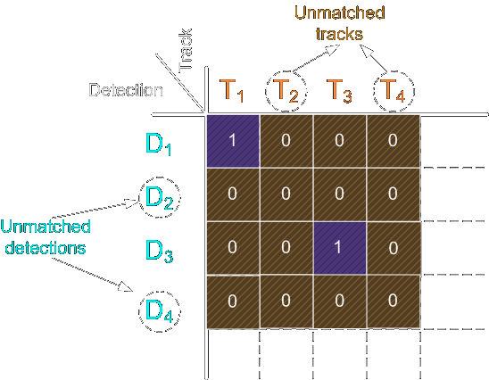

<style>
a    {text-decoration: underline;color: red;}
</style>
# Track Everything - Pipeline Overview

<span style="color:white;">
You can find this project in one of my repositories [here](https://github.com/ami-a/TrackEverything).
</span>
## The Pipeline
<span style="color:white;">
The pipeline starts by receiving a series of images (frames) and outputs a list of tracker objects that contains the objects detected and the probability of them being in a class.</span>
<p align="center"></p>

## Breaking it Down to 5 Steps

### 1st Step - Get All Detections in Current Frame 
<span style="color:white;">
First, we take the frame and passe it through an object detection model, we can use any Python model, then filter out redundant overlapping detections using the Non-maximum Suppression (NMS) method and add all of the detection to the `detections` list.
</span>
### 2nd Step - Get Classification Probabilities for the Detected Objects
<span style="color:white;">
After we have the detections from step 1, we put them through a classification model to determine the probability of them being in a certain class (if no classification model is supplied the classification is applied during the previous step). We do this by cropping the frame to the object bounding box and then pass it through the classification model. We add this data as a vector of probabilities to each of the detection in the `detections` list. </span>
### 3rd Step - Updated the Trackers Object List
<span style="color:white;">
We have a list of `trackers` object which is a class that contains among other things an OpenCV tracker object, unique ID, previous statistics about this ID and indicators for the accuracy of this tracker. In the first frame, this `trackers` list is empty and then in step 4, it's being filled with new trackers matching the detected objects. If the `trackers` list is not empty, in this step we update the trackers' positions using the current frame and dispose of failed trackers.
</span>
### 4th Step - Matching Detection with Trackers
<span style="color:white;">
Using intersection over union (IOU) of a tracker bounding box and detection bounding box as a metric. We solve the linear sum assignment problem (also known as minimum weight matching in bipartite graphs) for the IOU matrix using the Hungarian algorithm (also known as Munkres algorithm). The machine learning package `SciPy` has a build-in utility function that implements the Hungarian algorithm.
</span>
```bash
matched_idx = linear_sum_assignment(-iou_matrix)
```
<span style="color:white;">
The linear_sum_assignment function by default minimizes the cost, so we need to reverse the sign of IOU matrix for maximization.<br>
The result will look like this:
</span>
<p align="center"></p>
<span style="color:white;">
For each unmatched detector, we create a new tracker with the detector's data, for the unmatched trackers we update the accuracy indicators for the tracker and remove any that are way off. For the matched ones, we update the tracker position to the more accurate detection box, we get the classification data and use the `StatisticalCalculator` class to adjust the results.
</span>
### 5th Step - Decide What to Do
<span style="color:white;">
After step 4 the `trackers` list is up to date with all the statistical and current data. The tracker class has a method to return the current classifications and confidence of those scores, we then update the detectors and iterate through them. A detector with a low confidence score probably came from a tracker with not enough data or the detection is poor, we can mark those using the `uncertainty` parameters in the `VisualizationVars`. We can then draw all the results or get the results directly from the `detections` list.
</span>


